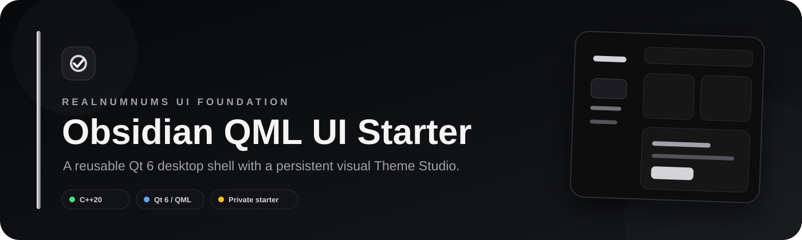
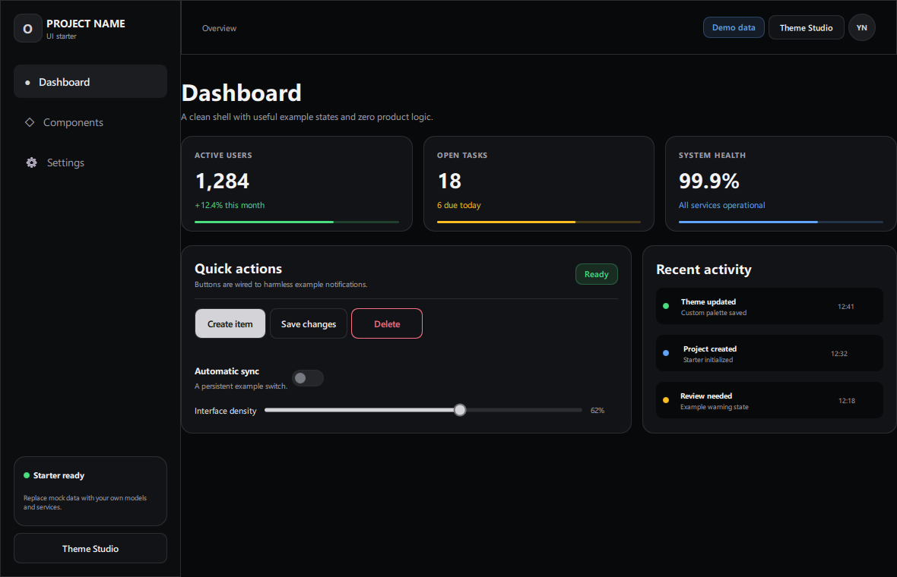
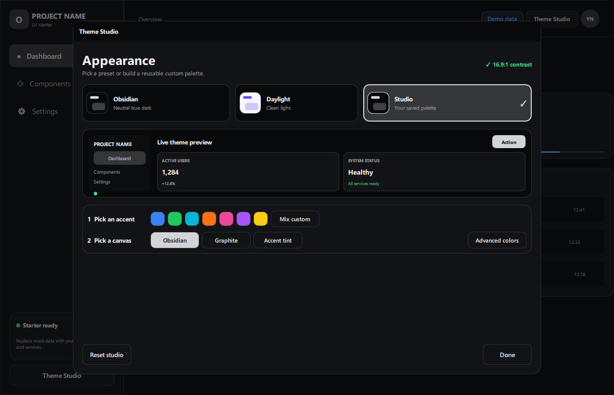

<p align="center">
  
</p>

<p align="center">
  <strong>A private, reusable C++20 and Qt 6 desktop UI foundation.</strong><br>
  Neutral by default. Product logic intentionally not included.
</p>

<p align="center">
  
  
  
  
</p>



<details>
<summary><strong>Theme Studio preview</strong></summary>



</details>

## What this is

This repository preserves the design system behind the neutral Obsidian desktop
interface as a clean starter for unrelated future applications. It contains no
platform integration, accounts, automation, networking, updater, or inherited
product branding—only a polished application shell, reusable controls, mock
content, and the visual Theme Studio.

## Included

- Obsidian, Daylight, and persistent Studio themes
- Guided accent and canvas selection
- Advanced seven-role palette editor
- Live preview and WCAG-style contrast feedback
- Theme-aware buttons, cards, navigation, switches, sliders, badges, inputs,
  progress bars, dialogs, scrolling pages, and toast notifications
- Mock Dashboard, Components, and Settings pages
- C++20 Qt launcher with forced Basic controls style
- One-command Windows build script and GitHub Actions validation
- Built-in `--screenshot` mode for keeping repository previews current

## Quick start

Requirements: CMake 3.24+, Qt 6.5+ with Quick/QML/Quick Controls, and a C++20
compiler.

```powershell
./scripts/build.ps1 -Configuration Release
```

Or use CMake directly:

```powershell
cmake -S . -B build -DCMAKE_BUILD_TYPE=Release
cmake --build build --config Release --parallel
```

## Make it yours

1. Rename the organization and application identifiers in `src/main.cpp`.
2. Replace `PROJECT NAME` and mock models in `qml/Main.qml`.
3. Keep `Theme.qml`, `ThemeStudio.qml`, and `qml/components/` as the reusable
   design foundation.
4. Connect buttons and controls to your own C++ services or QML models.

See [the theming guide](docs/THEMING.md) for semantic color roles and extension
rules.

## Repository map

```text
qml/
  Main.qml              Generic app shell and example pages
  Theme.qml             Persistent semantic palette
  ThemeStudio.qml       Visual theme editor
  components/           Reusable themed controls
src/main.cpp            Minimal native launcher + screenshot mode
docs/                   Theme notes and GitHub artwork
scripts/build.ps1       Windows build helper
```

## Preview refresh

After building, regenerate the README screenshot without manual cropping:

```powershell
./build/obsidian-ui-starter.exe --screenshot docs/assets/preview.png
./build/obsidian-ui-starter.exe --custom-theme --theme-studio --screenshot docs/assets/theme-studio.png
```

## Ownership

Private source owned by RealNumNums. See [LICENSE.md](LICENSE.md).
